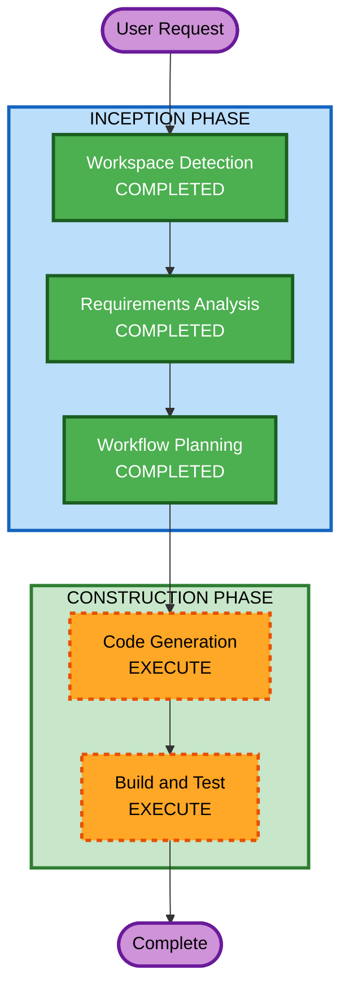

# Execution Plan

## Detailed Analysis Summary

### Change Impact Assessment
- **User-facing changes**: Yes — entirely new web application
- **Structural changes**: Yes — new full-stack architecture
- **Data model changes**: Yes — new data models for agents, tasks, blueprints
- **API changes**: Yes — new API routes
- **NFR impact**: No — demo-level, no production NFRs

### Risk Assessment
- **Risk Level**: Low (greenfield demo, no production impact)
- **Rollback Complexity**: Easy (no existing system to break)
- **Testing Complexity**: Simple (demo-level verification)

## Workflow Visualization



### Text Alternative
```
INCEPTION PHASE:
  - Workspace Detection (COMPLETED)
  - Requirements Analysis (COMPLETED)
  - Workflow Planning (COMPLETED)
  - User Stories (SKIPPED - demo timeline)
  - Application Design (SKIPPED - requirements sufficient)
  - Units Generation (SKIPPED - single unit, defined in code gen plan)

CONSTRUCTION PHASE:
  - Functional Design (SKIPPED - demo timeline)
  - NFR Requirements (SKIPPED - no production NFRs)
  - NFR Design (SKIPPED - no production NFRs)
  - Infrastructure Design (SKIPPED - localhost only)
  - Code Generation (EXECUTE)
  - Build and Test (EXECUTE)
```

## Phases to Execute

### INCEPTION PHASE
- [x] Workspace Detection (COMPLETED)
- [x] Requirements Analysis (COMPLETED)
- [x] Workflow Planning (IN PROGRESS)
- SKIP: User Stories — Demo timeline, single internal audience
- SKIP: Application Design — Requirements + ABCA analysis provide sufficient architecture
- SKIP: Units Generation — Single unit (full Next.js app), defined in code generation plan

### CONSTRUCTION PHASE
- SKIP: Functional Design — Demo timeline, go straight to code
- SKIP: NFR Requirements — No production NFRs for localhost demo
- SKIP: NFR Design — No production NFRs
- SKIP: Infrastructure Design — Localhost only, no cloud infra
- [ ] Code Generation - EXECUTE
  - **Rationale**: Core implementation needed. Will include planning + generation.
- [ ] Build and Test - EXECUTE
  - **Rationale**: Verify the demo runs with `npm run dev`

## Success Criteria
- **Primary Goal**: Working localhost demo of the agent platform single pane of glass
- **Key Deliverables**:
  - Next.js app with all 5 capability views (Build, Deploy, Invoke, Monitor, Debug)
  - Agent catalog/registry page
  - Mocked data for demo scenarios
  - Integration point for aws-samples agent harness
  - Real-time dashboard UI for monitoring
  - Simulated Jira epic/ticket structure
- **Quality Gates**:
  - App starts with single command
  - All navigation works
  - Demo flow is presentable
