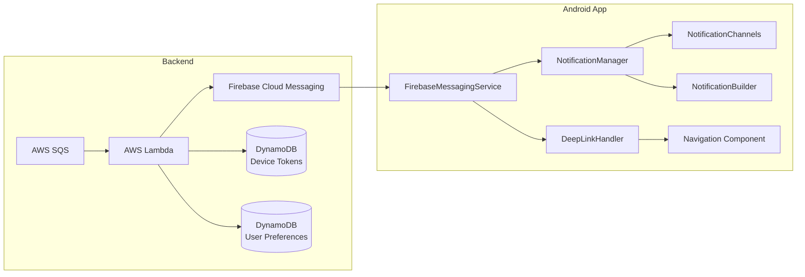
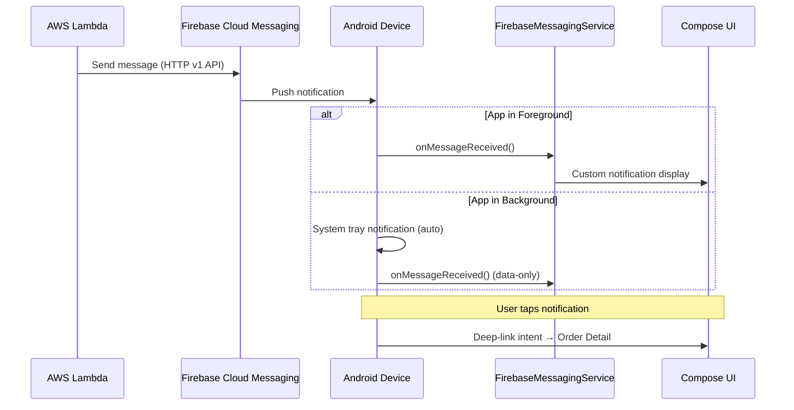
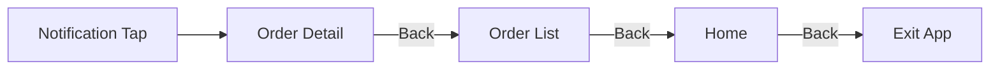
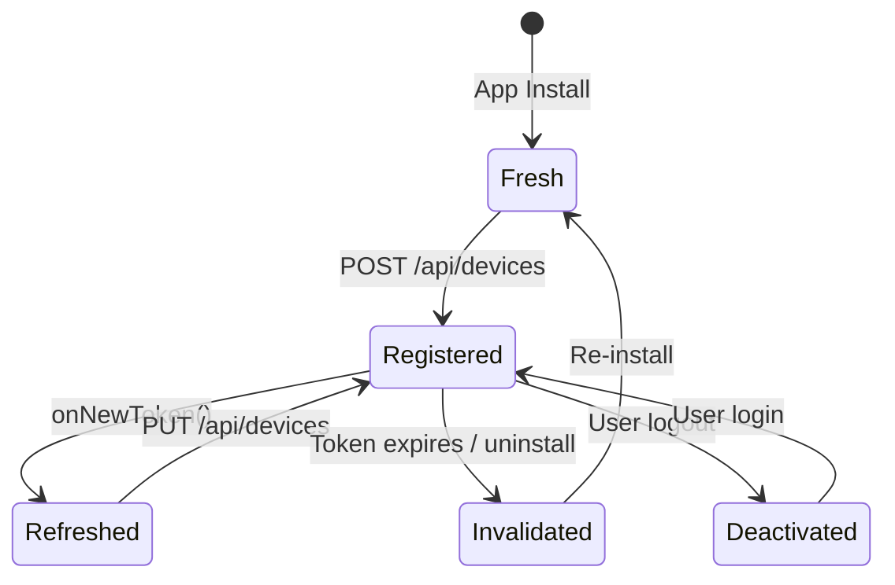
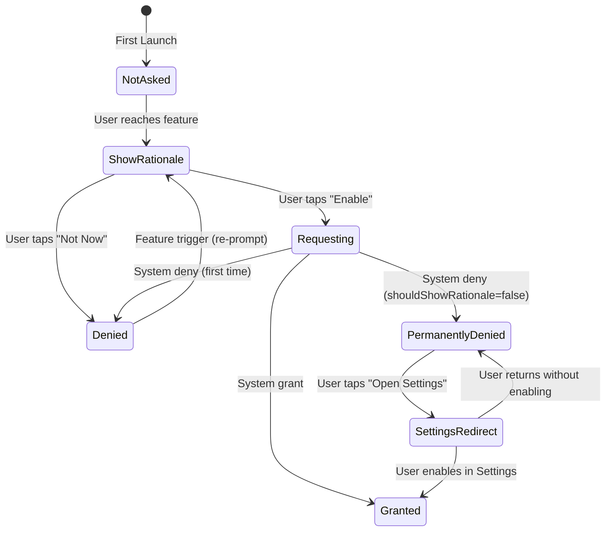

# Android Push Notification Design Document

## AgentCore Console — Companion Android App

| Field | Value |
|-------|-------|
| **Status** | Draft |
| **Author** | Platform Engineering |
| **Date** | 2026-05-30 |
| **Min SDK** | 26 (Android 8.0 Oreo) |
| **Target SDK** | 34 (Android 14) |
| **Language** | Kotlin |
| **UI Framework** | Jetpack Compose + Material Design 3 |

---

## 1. Architecture Overview

### Technology Stack

| Layer | Technology |
|-------|------------|
| UI | Jetpack Compose, Material Design 3 |
| Architecture | MVVM with StateFlow |
| DI | Hilt |
| Navigation | Navigation Component (Compose) |
| Messaging | Firebase Cloud Messaging SDK |
| Background Work | WorkManager |
| Networking | Retrofit + OkHttp |
| Serialization | Kotlinx Serialization |

### System Architecture



### Message Flow



### Package Structure

```
com.agentcore.console/
├── di/
│   └── NotificationModule.kt
├── data/
│   ├── model/
│   │   ├── FcmPayload.kt
│   │   ├── NotificationPreference.kt
│   │   └── DeviceRegistration.kt
│   ├── remote/
│   │   └── DeviceTokenApi.kt
│   └── repository/
│       ├── DeviceTokenRepository.kt
│       └── NotificationPreferenceRepository.kt
├── domain/
│   ├── model/
│   │   ├── OrderStatus.kt
│   │   └── NotificationPermissionState.kt
│   └── usecase/
│       ├── RegisterTokenUseCase.kt
│       └── UpdatePreferenceUseCase.kt
├── notification/
│   ├── FCMService.kt
│   ├── NotificationChannelManager.kt
│   ├── NotificationBuilderFactory.kt
│   ├── NotificationGroupManager.kt
│   └── DeepLinkHandler.kt
├── permission/
│   ├── PermissionManager.kt
│   └── PermissionViewModel.kt
├── ui/
│   ├── navigation/
│   │   └── AppNavGraph.kt
│   ├── settings/
│   │   ├── NotificationSettingsScreen.kt
│   │   └── NotificationSettingsViewModel.kt
│   └── permission/
│       ├── NotificationPermissionScreen.kt
│       └── PermissionRationaleDialog.kt
└── worker/
    └── TokenRegistrationWorker.kt
```

---

## 2. FCM Payload Structures

All payloads use the FCM HTTP v1 API format. Each payload includes both `notification` (for system tray display when backgrounded) and `data` (for app-level processing). The deep-link URL is always included in `data` to enable navigation regardless of app state.

### 2.1 order_confirmed

```json
{
  "message": {
    "token": "device_token_here",
    "notification": {
      "title": "Order Confirmed",
      "body": "Your order #ORD-2024-78432 has been confirmed and is being prepared."
    },
    "data": {
      "type": "order_confirmed",
      "order_id": "ORD-2024-78432",
      "timestamp": "2026-05-30T14:30:00Z",
      "deep_link": "agentcore://orders/ORD-2024-78432",
      "group_key": "order_updates_user_12345",
      "estimated_delivery": "2026-06-02T18:00:00Z"
    },
    "android": {
      "priority": "HIGH",
      "notification": {
        "channel_id": "order_status_updates",
        "icon": "ic_notification_order",
        "color": "#1B5E20",
        "click_action": "OPEN_ORDER_DETAIL",
        "tag": "order_ORD-2024-78432"
      }
    }
  }
}
```

**Estimated size:** ~620 bytes

### 2.2 order_shipped

```json
{
  "message": {
    "token": "device_token_here",
    "notification": {
      "title": "Order Shipped",
      "body": "Your order #ORD-2024-78432 has shipped! Tracking: 1Z999AA10123456784"
    },
    "data": {
      "type": "order_shipped",
      "order_id": "ORD-2024-78432",
      "timestamp": "2026-05-30T16:45:00Z",
      "deep_link": "agentcore://orders/ORD-2024-78432",
      "group_key": "order_updates_user_12345",
      "tracking_number": "1Z999AA10123456784",
      "carrier": "UPS",
      "estimated_delivery": "2026-06-02T18:00:00Z"
    },
    "android": {
      "priority": "HIGH",
      "notification": {
        "channel_id": "order_status_updates",
        "icon": "ic_notification_shipped",
        "color": "#0D47A1",
        "click_action": "OPEN_ORDER_DETAIL",
        "tag": "order_ORD-2024-78432"
      }
    }
  }
}
```

**Estimated size:** ~700 bytes

### 2.3 order_out_for_delivery

```json
{
  "message": {
    "token": "device_token_here",
    "notification": {
      "title": "Out for Delivery",
      "body": "Your order #ORD-2024-78432 is out for delivery and will arrive today!"
    },
    "data": {
      "type": "order_out_for_delivery",
      "order_id": "ORD-2024-78432",
      "timestamp": "2026-06-02T08:15:00Z",
      "deep_link": "agentcore://orders/ORD-2024-78432",
      "group_key": "order_updates_user_12345",
      "estimated_arrival_window": "2:00 PM - 6:00 PM",
      "delivery_address_last4": "4th St"
    },
    "android": {
      "priority": "HIGH",
      "notification": {
        "channel_id": "order_delivery_alerts",
        "icon": "ic_notification_delivery",
        "color": "#E65100",
        "click_action": "OPEN_ORDER_DETAIL",
        "tag": "order_ORD-2024-78432"
      }
    }
  }
}
```

**Estimated size:** ~690 bytes

### 2.4 order_delivered

```json
{
  "message": {
    "token": "device_token_here",
    "notification": {
      "title": "Order Delivered",
      "body": "Your order #ORD-2024-78432 has been delivered. Enjoy!"
    },
    "data": {
      "type": "order_delivered",
      "order_id": "ORD-2024-78432",
      "timestamp": "2026-06-02T15:22:00Z",
      "deep_link": "agentcore://orders/ORD-2024-78432",
      "group_key": "order_updates_user_12345",
      "delivered_to": "Front Door",
      "photo_url": "https://cdn.agentcore.io/deliveries/ORD-2024-78432/proof.jpg"
    },
    "android": {
      "priority": "HIGH",
      "notification": {
        "channel_id": "order_status_updates",
        "icon": "ic_notification_delivered",
        "color": "#2E7D32",
        "click_action": "OPEN_ORDER_DETAIL",
        "tag": "order_ORD-2024-78432"
      }
    }
  }
}
```

**Estimated size:** ~700 bytes

### 2.5 order_cancelled

```json
{
  "message": {
    "token": "device_token_here",
    "notification": {
      "title": "Order Cancelled",
      "body": "Your order #ORD-2024-78432 has been cancelled. Refund will be processed within 3-5 business days."
    },
    "data": {
      "type": "order_cancelled",
      "order_id": "ORD-2024-78432",
      "timestamp": "2026-05-30T17:00:00Z",
      "deep_link": "agentcore://orders/ORD-2024-78432",
      "group_key": "order_updates_user_12345",
      "cancellation_reason": "customer_requested",
      "refund_amount": "149.99",
      "refund_currency": "USD"
    },
    "android": {
      "priority": "HIGH",
      "notification": {
        "channel_id": "order_status_updates",
        "icon": "ic_notification_cancelled",
        "color": "#B71C1C",
        "click_action": "OPEN_ORDER_DETAIL",
        "tag": "order_ORD-2024-78432"
      }
    }
  }
}
```

**Estimated size:** ~730 bytes

### 2.6 order_delayed

```json
{
  "message": {
    "token": "device_token_here",
    "notification": {
      "title": "Delivery Delayed",
      "body": "Your order #ORD-2024-78432 delivery has been delayed. New estimated delivery: June 5, 2026."
    },
    "data": {
      "type": "order_delayed",
      "order_id": "ORD-2024-78432",
      "timestamp": "2026-06-01T10:00:00Z",
      "deep_link": "agentcore://orders/ORD-2024-78432",
      "group_key": "order_updates_user_12345",
      "original_delivery_date": "2026-06-02",
      "new_delivery_date": "2026-06-05",
      "delay_reason": "weather"
    },
    "android": {
      "priority": "NORMAL",
      "notification": {
        "channel_id": "order_status_updates",
        "icon": "ic_notification_delayed",
        "color": "#F57F17",
        "click_action": "OPEN_ORDER_DETAIL",
        "tag": "order_ORD-2024-78432"
      }
    }
  }
}
```

**Estimated size:** ~710 bytes

### Payload Size Validation

| Status Type | Estimated Size | Under 4096 Limit |
|-------------|---------------|-------------------|
| order_confirmed | ~620 bytes | ✅ |
| order_shipped | ~700 bytes | ✅ |
| order_out_for_delivery | ~690 bytes | ✅ |
| order_delivered | ~700 bytes | ✅ |
| order_cancelled | ~730 bytes | ✅ |
| order_delayed | ~710 bytes | ✅ |

All payloads are well under the 4096-byte FCM limit, leaving room for longer order IDs and dynamic content.

---

## 3. Notification Channels

### Channel Definitions

| Channel ID | Name | Description | Importance | Use Case |
|-----------|------|-------------|------------|----------|
| `order_status_updates` | Order Status Updates | Status changes for your orders | HIGH | confirmed, shipped, delivered, cancelled |
| `order_delivery_alerts` | Delivery Alerts | Real-time delivery arrival alerts | HIGH | out_for_delivery |
| `order_promotions` | Promotions & Offers | Deals and promotional updates | DEFAULT | marketing, offers |

### Channel Configuration

```kotlin
package com.agentcore.console.notification

import android.app.NotificationChannel
import android.app.NotificationManager
import android.content.Context
import android.media.AudioAttributes
import android.net.Uri
import androidx.core.app.NotificationManagerCompat

class NotificationChannelManager(private val context: Context) {

    companion object {
        const val CHANNEL_ORDER_STATUS = "order_status_updates"
        const val CHANNEL_DELIVERY_ALERTS = "order_delivery_alerts"
        const val CHANNEL_PROMOTIONS = "order_promotions"
        const val GROUP_ORDERS = "group_orders"
    }

    fun createAllChannels() {
        val notificationManager = context.getSystemService(NotificationManager::class.java)

        notificationManager.createNotificationChannelGroup(
            android.app.NotificationChannelGroup(GROUP_ORDERS, "Orders")
        )

        notificationManager.createNotificationChannels(
            listOf(
                createOrderStatusChannel(),
                createDeliveryAlertsChannel(),
                createPromotionsChannel()
            )
        )
    }

    private fun createOrderStatusChannel(): NotificationChannel {
        return NotificationChannel(
            CHANNEL_ORDER_STATUS,
            "Order Status Updates",
            NotificationManager.IMPORTANCE_HIGH
        ).apply {
            description = "Notifications for order confirmations, shipping updates, deliveries, and cancellations"
            group = GROUP_ORDERS
            enableVibration(true)
            vibrationPattern = longArrayOf(0, 250, 100, 250)
            setSound(
                Uri.parse("android.resource://${context.packageName}/raw/order_status"),
                AudioAttributes.Builder()
                    .setContentType(AudioAttributes.CONTENT_TYPE_SONIFICATION)
                    .setUsage(AudioAttributes.USAGE_NOTIFICATION)
                    .build()
            )
            enableLights(true)
            lightColor = 0xFF1B5E20.toInt()
            lockscreenVisibility = android.app.Notification.VISIBILITY_PUBLIC
            setShowBadge(true)
        }
    }

    private fun createDeliveryAlertsChannel(): NotificationChannel {
        return NotificationChannel(
            CHANNEL_DELIVERY_ALERTS,
            "Delivery Alerts",
            NotificationManager.IMPORTANCE_HIGH
        ).apply {
            description = "Real-time alerts when your delivery is arriving"
            group = GROUP_ORDERS
            enableVibration(true)
            vibrationPattern = longArrayOf(0, 500, 200, 500, 200, 500)
            setSound(
                Uri.parse("android.resource://${context.packageName}/raw/delivery_alert"),
                AudioAttributes.Builder()
                    .setContentType(AudioAttributes.CONTENT_TYPE_SONIFICATION)
                    .setUsage(AudioAttributes.USAGE_NOTIFICATION)
                    .build()
            )
            enableLights(true)
            lightColor = 0xFFE65100.toInt()
            lockscreenVisibility = android.app.Notification.VISIBILITY_PUBLIC
            setShowBadge(true)
        }
    }

    private fun createPromotionsChannel(): NotificationChannel {
        return NotificationChannel(
            CHANNEL_PROMOTIONS,
            "Promotions & Offers",
            NotificationManager.IMPORTANCE_DEFAULT
        ).apply {
            description = "Deals, discounts, and promotional offers"
            group = GROUP_ORDERS
            enableVibration(false)
            setSound(
                Uri.parse("android.resource://${context.packageName}/raw/promo_chime"),
                AudioAttributes.Builder()
                    .setContentType(AudioAttributes.CONTENT_TYPE_SONIFICATION)
                    .setUsage(AudioAttributes.USAGE_NOTIFICATION)
                    .build()
            )
            enableLights(true)
            lightColor = 0xFF6200EE.toInt()
            lockscreenVisibility = android.app.Notification.VISIBILITY_PRIVATE
            setShowBadge(false)
        }
    }
}
```

### Channel Configuration Summary

| Property | order_status_updates | order_delivery_alerts | order_promotions |
|----------|---------------------|----------------------|-----------------|
| Importance | HIGH | HIGH | DEFAULT |
| Vibration | `[0, 250, 100, 250]` | `[0, 500, 200, 500, 200, 500]` | Disabled |
| Sound | `order_status.ogg` | `delivery_alert.ogg` | `promo_chime.ogg` |
| LED Color | Green `#1B5E20` | Orange `#E65100` | Purple `#6200EE` |
| Lock Screen | PUBLIC | PUBLIC | PRIVATE |
| Badge | Yes | Yes | No |
| Group | Orders | Orders | Orders |

---

## 4. Deep-Link Intent Configuration

### 4.1 URI Scheme

```
agentcore://orders/{orderId}
agentcore://orders                  → Order List
agentcore://settings/notifications  → Notification Settings
```

### 4.2 AndroidManifest.xml Intent Filter

```xml
<activity
    android:name=".MainActivity"
    android:exported="true"
    android:launchMode="singleTop">

    <intent-filter>
        <action android:name="android.intent.action.MAIN" />
        <category android:name="android.intent.category.LAUNCHER" />
    </intent-filter>

    <!-- Deep link for order detail -->
    <intent-filter android:autoVerify="true">
        <action android:name="android.intent.action.VIEW" />
        <category android:name="android.intent.category.DEFAULT" />
        <category android:name="android.intent.category.BROWSABLE" />
        <data
            android:scheme="agentcore"
            android:host="orders" />
    </intent-filter>

    <!-- Deep link for settings -->
    <intent-filter>
        <action android:name="android.intent.action.VIEW" />
        <category android:name="android.intent.category.DEFAULT" />
        <category android:name="android.intent.category.BROWSABLE" />
        <data
            android:scheme="agentcore"
            android:host="settings" />
    </intent-filter>

    <!-- FCM click action -->
    <intent-filter>
        <action android:name="OPEN_ORDER_DETAIL" />
        <category android:name="android.intent.category.DEFAULT" />
    </intent-filter>
</activity>
```

### 4.3 Navigation Graph with Deep Links (Compose)

```kotlin
package com.agentcore.console.ui.navigation

import androidx.compose.runtime.Composable
import androidx.navigation.NavHostController
import androidx.navigation.NavType
import androidx.navigation.compose.NavHost
import androidx.navigation.compose.composable
import androidx.navigation.navArgument
import androidx.navigation.navDeepLink

sealed class Screen(val route: String) {
    data object Home : Screen("home")
    data object OrderList : Screen("orders")
    data object OrderDetail : Screen("orders/{orderId}") {
        fun createRoute(orderId: String) = "orders/$orderId"
    }
    data object NotificationSettings : Screen("settings/notifications")
}

@Composable
fun AppNavGraph(navController: NavHostController) {
    NavHost(
        navController = navController,
        startDestination = Screen.Home.route
    ) {
        composable(Screen.Home.route) {
            HomeScreen(navController)
        }

        composable(Screen.OrderList.route) {
            OrderListScreen(navController)
        }

        composable(
            route = Screen.OrderDetail.route,
            arguments = listOf(
                navArgument("orderId") { type = NavType.StringType }
            ),
            deepLinks = listOf(
                navDeepLink {
                    uriPattern = "agentcore://orders/{orderId}"
                    action = "OPEN_ORDER_DETAIL"
                }
            )
        ) { backStackEntry ->
            val orderId = backStackEntry.arguments?.getString("orderId") ?: return@composable
            OrderDetailScreen(orderId = orderId, navController = navController)
        }

        composable(
            route = Screen.NotificationSettings.route,
            deepLinks = listOf(
                navDeepLink { uriPattern = "agentcore://settings/notifications" }
            )
        ) {
            NotificationSettingsScreen(navController)
        }
    }
}
```

### 4.4 Pending Intent Construction

```kotlin
package com.agentcore.console.notification

import android.app.PendingIntent
import android.app.TaskStackBuilder
import android.content.Context
import android.content.Intent
import androidx.core.net.toUri

class DeepLinkHandler(private val context: Context) {

    fun createOrderDetailPendingIntent(orderId: String, notificationId: Int): PendingIntent {
        val deepLinkUri = "agentcore://orders/$orderId".toUri()

        val intent = Intent(Intent.ACTION_VIEW, deepLinkUri).apply {
            setPackage(context.packageName)
            flags = Intent.FLAG_ACTIVITY_NEW_TASK or Intent.FLAG_ACTIVITY_CLEAR_TOP
        }

        val taskStackBuilder = TaskStackBuilder.create(context).apply {
            addNextIntentWithParentStack(createHomeIntent())
            addNextIntent(createOrderListIntent())
            addNextIntent(intent)
        }

        return taskStackBuilder.getPendingIntent(
            notificationId,
            PendingIntent.FLAG_UPDATE_CURRENT or PendingIntent.FLAG_IMMUTABLE
        )
    }

    private fun createHomeIntent(): Intent {
        return Intent(Intent.ACTION_VIEW, "agentcore://home".toUri()).apply {
            setPackage(context.packageName)
        }
    }

    private fun createOrderListIntent(): Intent {
        return Intent(Intent.ACTION_VIEW, "agentcore://orders".toUri()).apply {
            setPackage(context.packageName)
        }
    }
}
```

### 4.5 Back Stack Behavior



When the user taps a notification:
1. The app opens to **Order Detail** for the specific order
2. Pressing back navigates to **Order List** (synthetic back stack)
3. Pressing back again navigates to **Home**
4. Pressing back exits the app

---

## 5. Notification Grouping

### 5.1 Group Key Strategy

Group key format: `order_updates_{userId}`

All order status notifications for a given user share the same group key.

### 5.2 Grouping Implementation

```kotlin
package com.agentcore.console.notification

import android.app.Notification
import android.app.NotificationManager
import android.content.Context
import androidx.core.app.NotificationCompat

class NotificationGroupManager(private val context: Context) {

    companion object {
        const val GROUP_KEY_PREFIX = "order_updates_"
        const val SUMMARY_NOTIFICATION_ID = 0
        const val MAX_INDIVIDUAL_NOTIFICATIONS = 4
    }

    fun shouldShowGroupSummary(userId: String): Boolean {
        val notificationManager = context.getSystemService(NotificationManager::class.java)
        val activeNotifications = notificationManager.activeNotifications
        val groupNotifications = activeNotifications.filter {
            it.notification.group == "$GROUP_KEY_PREFIX$userId"
        }
        return groupNotifications.size >= MAX_INDIVIDUAL_NOTIFICATIONS
    }

    fun buildGroupSummary(
        userId: String,
        notifications: List<OrderNotificationData>
    ): Notification {
        val inboxStyle = NotificationCompat.InboxStyle()
            .setBigContentTitle("${notifications.size} Order Updates")
            .setSummaryText("AgentCore Console")

        notifications.takeLast(5).forEach { data ->
            inboxStyle.addLine("${data.title}: ${data.orderIdShort}")
        }

        return NotificationCompat.Builder(context, NotificationChannelManager.CHANNEL_ORDER_STATUS)
            .setSmallIcon(R.drawable.ic_notification_orders)
            .setContentTitle("${notifications.size} Order Updates")
            .setContentText("You have ${notifications.size} order status updates")
            .setStyle(inboxStyle)
            .setGroup("$GROUP_KEY_PREFIX$userId")
            .setGroupSummary(true)
            .setAutoCancel(true)
            .setNumber(notifications.size)
            .build()
    }

    fun buildIndividualNotification(
        data: OrderNotificationData,
        userId: String,
        pendingIntent: android.app.PendingIntent
    ): Notification {
        return NotificationCompat.Builder(context, data.channelId)
            .setSmallIcon(data.iconRes)
            .setContentTitle(data.title)
            .setContentText(data.body)
            .setColor(data.color)
            .setGroup("$GROUP_KEY_PREFIX$userId")
            .setGroupSummary(false)
            .setAutoCancel(true)
            .setContentIntent(pendingIntent)
            .setCategory(NotificationCompat.CATEGORY_STATUS)
            .build()
    }
}

data class OrderNotificationData(
    val orderId: String,
    val orderIdShort: String,
    val title: String,
    val body: String,
    val channelId: String,
    val iconRes: Int,
    val color: Int,
    val deepLink: String
)
```

### 5.3 Grouping Behavior

| Active Notifications | Behavior |
|---------------------|----------|
| 1–3 | Individual notifications displayed |
| 4+ | Group summary replaces individual view; expanding shows all |

### 5.4 Tap Behavior

| Target | Action |
|--------|--------|
| Individual notification | Navigate to specific order detail |
| Group summary | Navigate to order list |

---

## 6. Token Refresh Flow

### 6.1 Token Lifecycle



### 6.2 FirebaseMessagingService Implementation

```kotlin
package com.agentcore.console.notification

import android.util.Log
import androidx.work.*
import com.agentcore.console.worker.TokenRegistrationWorker
import com.google.firebase.messaging.FirebaseMessagingService
import com.google.firebase.messaging.RemoteMessage
import dagger.hilt.android.AndroidEntryPoint
import java.util.concurrent.TimeUnit
import javax.inject.Inject

@AndroidEntryPoint
class FCMService : FirebaseMessagingService() {

    @Inject lateinit var notificationHandler: NotificationHandler
    @Inject lateinit var tokenStorage: TokenStorage

    override fun onNewToken(token: String) {
        super.onNewToken(token)
        Log.d("FCMService", "New token received")
        tokenStorage.saveLocalToken(token)
        enqueueTokenRegistration(token)
    }

    override fun onMessageReceived(message: RemoteMessage) {
        super.onMessageReceived(message)
        notificationHandler.handleMessage(message)
    }

    private fun enqueueTokenRegistration(token: String) {
        val workData = Data.Builder()
            .putString(TokenRegistrationWorker.KEY_TOKEN, token)
            .build()

        val workRequest = OneTimeWorkRequestBuilder<TokenRegistrationWorker>()
            .setInputData(workData)
            .setConstraints(
                Constraints.Builder()
                    .setRequiredNetworkType(NetworkType.CONNECTED)
                    .build()
            )
            .setBackoffCriteria(
                BackoffPolicy.EXPONENTIAL,
                30,
                TimeUnit.SECONDS
            )
            .build()

        WorkManager.getInstance(this)
            .enqueueUniqueWork(
                TokenRegistrationWorker.WORK_NAME,
                ExistingWorkPolicy.REPLACE,
                workRequest
            )
    }
}
```

### 6.3 Token Registration Worker

```kotlin
package com.agentcore.console.worker

import android.content.Context
import androidx.hilt.work.HiltWorker
import androidx.work.CoroutineWorker
import androidx.work.WorkerParameters
import com.agentcore.console.data.remote.DeviceTokenApi
import com.agentcore.console.data.model.DeviceRegistrationRequest
import dagger.assisted.Assisted
import dagger.assisted.AssistedInject

@HiltWorker
class TokenRegistrationWorker @AssistedInject constructor(
    @Assisted context: Context,
    @Assisted params: WorkerParameters,
    private val deviceTokenApi: DeviceTokenApi,
    private val tokenStorage: TokenStorage,
    private val userSession: UserSession
) : CoroutineWorker(context, params) {

    companion object {
        const val WORK_NAME = "token_registration"
        const val KEY_TOKEN = "device_token"
        const val MAX_RETRIES = 5
    }

    override suspend fun doWork(): Result {
        if (runAttemptCount >= MAX_RETRIES) {
            return Result.failure()
        }

        val token = inputData.getString(KEY_TOKEN) ?: tokenStorage.getLocalToken()
        if (token == null) {
            return Result.failure()
        }

        val userId = userSession.getCurrentUserId() ?: return Result.retry()

        return try {
            val request = DeviceRegistrationRequest(
                userId = userId,
                deviceId = tokenStorage.getDeviceId(),
                deviceToken = token,
                platform = "android",
                active = true
            )
            deviceTokenApi.registerToken(request)
            tokenStorage.markTokenSynced()
            Result.success()
        } catch (e: Exception) {
            Result.retry()
        }
    }
}
```

### 6.4 Backend API Contract

**Register/Update Token: `PUT /api/devices`**

```json
{
  "userId": "user_12345",
  "deviceId": "a1b2c3d4-e5f6-7890-abcd-ef1234567890",
  "deviceToken": "fMRR1...<fcm_token>",
  "platform": "android",
  "active": true
}
```

**Response: 200 OK**
```json
{
  "success": true,
  "updatedAt": "2026-05-30T14:30:00Z"
}
```

### 6.5 Token Invalidation

When the backend receives an FCM error indicating an invalid token (`UNREGISTERED`, `INVALID_ARGUMENT`):
1. Lambda marks `active = false` in DynamoDB
2. On next app open, the app checks if the stored token matches the current FCM token
3. If mismatched, re-registers via WorkManager

---

## 7. Android 13+ Permission Flow (POST_NOTIFICATIONS)

### 7.1 Permission State Machine



### 7.2 Permission State

```kotlin
package com.agentcore.console.domain.model

sealed class NotificationPermissionState {
    data object NotDetermined : NotificationPermissionState()
    data object ShouldShowRationale : NotificationPermissionState()
    data object Granted : NotificationPermissionState()
    data object Denied : NotificationPermissionState()
    data object PermanentlyDenied : NotificationPermissionState()
}
```

### 7.3 Permission Manager

```kotlin
package com.agentcore.console.permission

import android.Manifest
import android.content.Context
import android.content.Intent
import android.content.pm.PackageManager
import android.os.Build
import android.provider.Settings
import androidx.activity.ComponentActivity
import androidx.core.content.ContextCompat
import com.agentcore.console.domain.model.NotificationPermissionState
import kotlinx.coroutines.flow.MutableStateFlow
import kotlinx.coroutines.flow.StateFlow
import kotlinx.coroutines.flow.asStateFlow

class PermissionManager(private val context: Context) {

    private val _permissionState = MutableStateFlow<NotificationPermissionState>(
        NotificationPermissionState.NotDetermined
    )
    val permissionState: StateFlow<NotificationPermissionState> = _permissionState.asStateFlow()

    fun checkCurrentState(activity: ComponentActivity): NotificationPermissionState {
        if (Build.VERSION.SDK_INT < Build.VERSION_CODES.TIRAMISU) {
            _permissionState.value = NotificationPermissionState.Granted
            return NotificationPermissionState.Granted
        }

        val state = when {
            ContextCompat.checkSelfPermission(
                context,
                Manifest.permission.POST_NOTIFICATIONS
            ) == PackageManager.PERMISSION_GRANTED -> {
                NotificationPermissionState.Granted
            }
            activity.shouldShowRequestPermissionRationale(
                Manifest.permission.POST_NOTIFICATIONS
            ) -> {
                NotificationPermissionState.ShouldShowRationale
            }
            hasBeenAskedBefore() -> {
                NotificationPermissionState.PermanentlyDenied
            }
            else -> {
                NotificationPermissionState.NotDetermined
            }
        }

        _permissionState.value = state
        return state
    }

    fun markAsAsked() {
        context.getSharedPreferences("notification_prefs", Context.MODE_PRIVATE)
            .edit()
            .putBoolean("permission_asked", true)
            .apply()
    }

    private fun hasBeenAskedBefore(): Boolean {
        return context.getSharedPreferences("notification_prefs", Context.MODE_PRIVATE)
            .getBoolean("permission_asked", false)
    }

    fun openAppSettings() {
        val intent = Intent(Settings.ACTION_APP_NOTIFICATION_SETTINGS).apply {
            putExtra(Settings.EXTRA_APP_PACKAGE, context.packageName)
            flags = Intent.FLAG_ACTIVITY_NEW_TASK
        }
        context.startActivity(intent)
    }
}
```

### 7.4 Permission UI (Compose)

```kotlin
package com.agentcore.console.ui.permission

import android.Manifest
import android.os.Build
import androidx.activity.compose.rememberLauncherForActivityResult
import androidx.activity.result.contract.ActivityResultContracts
import androidx.compose.foundation.layout.*
import androidx.compose.material3.*
import androidx.compose.runtime.*
import androidx.compose.ui.Alignment
import androidx.compose.ui.Modifier
import androidx.compose.ui.res.painterResource
import androidx.compose.ui.semantics.contentDescription
import androidx.compose.ui.semantics.semantics
import androidx.compose.ui.text.style.TextAlign
import androidx.compose.ui.unit.dp
import androidx.hilt.navigation.compose.hiltViewModel
import com.agentcore.console.R
import com.agentcore.console.domain.model.NotificationPermissionState
import com.agentcore.console.permission.PermissionViewModel

@Composable
fun NotificationPermissionScreen(
    viewModel: PermissionViewModel = hiltViewModel(),
    onPermissionHandled: () -> Unit
) {
    val permissionState by viewModel.permissionState.collectAsState()
    val showRationale by viewModel.showRationaleDialog.collectAsState()

    val permissionLauncher = rememberLauncherForActivityResult(
        contract = ActivityResultContracts.RequestPermission()
    ) { granted ->
        viewModel.onPermissionResult(granted)
        if (granted) onPermissionHandled()
    }

    if (showRationale) {
        PermissionRationaleDialog(
            onConfirm = {
                viewModel.requestPermission()
                if (Build.VERSION.SDK_INT >= Build.VERSION_CODES.TIRAMISU) {
                    permissionLauncher.launch(Manifest.permission.POST_NOTIFICATIONS)
                }
            },
            onDismiss = {
                viewModel.dismissRationale()
                onPermissionHandled()
            }
        )
    }

    Column(
        modifier = Modifier
            .fillMaxSize()
            .padding(32.dp)
            .semantics { contentDescription = "Notification permission setup screen" },
        horizontalAlignment = Alignment.CenterHorizontally,
        verticalArrangement = Arrangement.Center
    ) {
        Icon(
            painter = painterResource(R.drawable.ic_notifications_active),
            contentDescription = null,
            modifier = Modifier.size(96.dp),
            tint = MaterialTheme.colorScheme.primary
        )

        Spacer(modifier = Modifier.height(24.dp))

        Text(
            text = "Stay Updated on Your Orders",
            style = MaterialTheme.typography.headlineMedium,
            textAlign = TextAlign.Center
        )

        Spacer(modifier = Modifier.height(16.dp))

        Text(
            text = "Get real-time notifications when your order is confirmed, shipped, and delivered.",
            style = MaterialTheme.typography.bodyLarge,
            textAlign = TextAlign.Center,
            color = MaterialTheme.colorScheme.onSurfaceVariant
        )

        Spacer(modifier = Modifier.height(48.dp))

        when (permissionState) {
            is NotificationPermissionState.NotDetermined,
            is NotificationPermissionState.ShouldShowRationale -> {
                Button(
                    onClick = { viewModel.showRationale() },
                    modifier = Modifier
                        .fillMaxWidth()
                        .semantics { contentDescription = "Enable notifications button" }
                ) {
                    Text("Enable Notifications")
                }
            }
            is NotificationPermissionState.PermanentlyDenied -> {
                Text(
                    text = "Notifications are disabled. Enable them in Settings to receive order updates.",
                    style = MaterialTheme.typography.bodyMedium,
                    textAlign = TextAlign.Center,
                    color = MaterialTheme.colorScheme.error
                )
                Spacer(modifier = Modifier.height(16.dp))
                OutlinedButton(
                    onClick = { viewModel.openSettings() },
                    modifier = Modifier
                        .fillMaxWidth()
                        .semantics { contentDescription = "Open notification settings" }
                ) {
                    Text("Open Settings")
                }
            }
            is NotificationPermissionState.Granted -> {
                LaunchedEffect(Unit) { onPermissionHandled() }
            }
            is NotificationPermissionState.Denied -> {
                TextButton(
                    onClick = onPermissionHandled,
                    modifier = Modifier.semantics { contentDescription = "Skip notification setup" }
                ) {
                    Text("Maybe Later")
                }
            }
        }

        Spacer(modifier = Modifier.height(16.dp))

        if (permissionState !is NotificationPermissionState.Granted) {
            TextButton(
                onClick = onPermissionHandled,
                modifier = Modifier.semantics { contentDescription = "Skip notification setup" }
            ) {
                Text("Skip for now")
            }
        }
    }
}

@Composable
fun PermissionRationaleDialog(
    onConfirm: () -> Unit,
    onDismiss: () -> Unit
) {
    AlertDialog(
        onDismissRequest = onDismiss,
        title = { Text("Notifications Permission") },
        text = {
            Text(
                "AgentCore Console needs notification permission to alert you about " +
                "order status changes, delivery updates, and important account activity. " +
                "You can change this anytime in Settings."
            )
        },
        confirmButton = {
            TextButton(onClick = onConfirm) { Text("Allow") }
        },
        dismissButton = {
            TextButton(onClick = onDismiss) { Text("Not Now") }
        }
    )
}
```

### 7.5 Graceful Degradation

When notifications are denied:
- All push-triggered features continue to work via in-app polling
- Order status changes are visible on the Orders screen (pull-to-refresh)
- A subtle banner on the Home screen indicates notifications are disabled with a "Turn On" action
- No repeated permission prompts unless the user triggers them

---

## 8. Foreground vs Background Handling

### 8.1 Delivery Behavior Matrix

| App State | Message Type | Behavior |
|-----------|-------------|----------|
| Foreground | notification + data | `onMessageReceived()` called; custom handling |
| Background | notification + data | System shows notification; `onMessageReceived()` receives `data` only on tap |
| Killed | notification + data | System shows notification; `onMessageReceived()` not called |
| Foreground | data only | `onMessageReceived()` called; must build notification manually |
| Background | data only | `onMessageReceived()` called; must build notification manually |

### 8.2 In-App Notification Event Bus

```kotlin
package com.agentcore.console.notification

import kotlinx.coroutines.flow.MutableSharedFlow
import kotlinx.coroutines.flow.SharedFlow
import kotlinx.coroutines.flow.asSharedFlow

data class InAppNotificationEvent(
    val orderId: String,
    val title: String,
    val body: String,
    val type: String
)

object NotificationEventBus {
    private val _events = MutableSharedFlow<InAppNotificationEvent>(extraBufferCapacity = 10)
    val events: SharedFlow<InAppNotificationEvent> = _events.asSharedFlow()

    fun emit(event: InAppNotificationEvent) {
        _events.tryEmit(event)
    }
}
```

### 8.3 Foreground In-App Snackbar

When the app is in the foreground, in addition to the system notification, a Material 3 Snackbar is displayed:

```kotlin
@Composable
fun InAppNotificationHost(snackbarHostState: SnackbarHostState) {
    val event by NotificationEventBus.events.collectAsState(initial = null)

    LaunchedEffect(event) {
        event?.let {
            snackbarHostState.showSnackbar(
                message = "${it.title}: ${it.body}",
                actionLabel = "View",
                duration = SnackbarDuration.Short
            )
        }
    }
}
```

---

## 9. State Management

### 9.1 TokenRegistrationState

```kotlin
sealed class TokenRegistrationState {
    data object Idle : TokenRegistrationState()
    data object Registering : TokenRegistrationState()
    data class Registered(val syncedAt: Long) : TokenRegistrationState()
    data class Failed(val error: String, val retryCount: Int) : TokenRegistrationState()
    data object TokenInvalid : TokenRegistrationState()
}
```

### 9.2 PreferencesUiState

```kotlin
data class PreferencesUiState(
    val isLoading: Boolean = true,
    val masterEnabled: Boolean = true,
    val orderStatusEnabled: Boolean = true,
    val deliveryAlertsEnabled: Boolean = true,
    val promotionsEnabled: Boolean = false,
    val error: String? = null
)
```

---

## 10. Data Models

### 10.1 FCM Payload Parsing

```kotlin
@Serializable
data class FcmOrderPayload(
    val type: String,
    @SerialName("order_id") val orderId: String,
    val timestamp: String,
    @SerialName("deep_link") val deepLink: String,
    @SerialName("group_key") val groupKey: String,
    @SerialName("tracking_number") val trackingNumber: String? = null,
    val carrier: String? = null,
    @SerialName("estimated_delivery") val estimatedDelivery: String? = null,
    @SerialName("cancellation_reason") val cancellationReason: String? = null,
    @SerialName("refund_amount") val refundAmount: String? = null,
    @SerialName("delay_reason") val delayReason: String? = null
)

enum class OrderStatusType(val value: String) {
    CONFIRMED("order_confirmed"),
    SHIPPED("order_shipped"),
    OUT_FOR_DELIVERY("order_out_for_delivery"),
    DELIVERED("order_delivered"),
    CANCELLED("order_cancelled"),
    DELAYED("order_delayed");

    companion object {
        fun fromValue(value: String): OrderStatusType? =
            entries.find { it.value == value }
    }
}
```

### 10.2 Device Registration Models

```kotlin
@Serializable
data class DeviceRegistrationRequest(
    @SerialName("userId") val userId: String,
    @SerialName("deviceId") val deviceId: String,
    @SerialName("deviceToken") val deviceToken: String,
    @SerialName("platform") val platform: String = "android",
    @SerialName("active") val active: Boolean = true
)

@Serializable
data class DeviceRegistrationResponse(
    @SerialName("success") val success: Boolean,
    @SerialName("updatedAt") val updatedAt: String
)
```

### 10.3 API Interface

```kotlin
interface DeviceTokenApi {
    @PUT("api/devices")
    suspend fun registerToken(@Body request: DeviceRegistrationRequest): DeviceRegistrationResponse

    @GET("api/users/{userId}/notification-preferences")
    suspend fun getPreferences(@Path("userId") userId: String): NotificationPreferences

    @PUT("api/users/{userId}/notification-preferences")
    suspend fun updatePreference(
        @Path("userId") userId: String,
        @Body request: PreferenceUpdateRequest
    ): NotificationPreferences
}
```

---

## 11. Accessibility

| Requirement | Implementation |
|------------|----------------|
| Screen reader support | `contentDescription` on all interactive elements |
| State announcements | TalkBack events on permission state changes |
| Touch targets | Minimum 48dp on all interactive elements |
| Color contrast | Material 3 color system ensures WCAG AA compliance |
| Semantic grouping | `mergeDescendants = true` on toggle rows |
| Heading hierarchy | `semantics { heading() }` on section headers |
| Live regions | Announcements for async state changes |
| Focus order | Logical tab order following visual layout |

---

## Appendix A: Gradle Dependencies

```kotlin
dependencies {
    // Firebase
    implementation(platform("com.google.firebase:firebase-bom:33.0.0"))
    implementation("com.google.firebase:firebase-messaging-ktx")

    // Compose
    implementation(platform("androidx.compose:compose-bom:2024.05.00"))
    implementation("androidx.compose.material3:material3")
    implementation("androidx.compose.ui:ui")
    implementation("androidx.navigation:navigation-compose:2.7.7")
    implementation("androidx.activity:activity-compose:1.9.0")

    // Hilt
    implementation("com.google.dagger:hilt-android:2.51.1")
    kapt("com.google.dagger:hilt-compiler:2.51.1")
    implementation("androidx.hilt:hilt-navigation-compose:1.2.0")
    implementation("androidx.hilt:hilt-work:1.2.0")
    kapt("androidx.hilt:hilt-compiler:1.2.0")

    // WorkManager
    implementation("androidx.work:work-runtime-ktx:2.9.0")

    // Networking
    implementation("com.squareup.retrofit2:retrofit:2.11.0")
    implementation("org.jetbrains.kotlinx:kotlinx-serialization-json:1.6.3")
    implementation("com.jakewharton.retrofit:retrofit2-kotlinx-serialization-converter:1.0.0")
    implementation("com.squareup.okhttp3:okhttp:4.12.0")

    // Core
    implementation("androidx.core:core-ktx:1.13.1")
    implementation("androidx.lifecycle:lifecycle-runtime-ktx:2.8.0")
    implementation("androidx.lifecycle:lifecycle-viewmodel-compose:2.8.0")
}
```

## Appendix B: Testing Strategy

| Layer | Tool | Focus |
|-------|------|-------|
| Unit | JUnit 5 + MockK | ViewModel logic, NotificationHandler routing, DeepLinkHandler URI construction |
| Integration | Robolectric | NotificationChannelManager channel creation, WorkManager enqueue |
| UI | Compose Testing | Permission flow states, Settings toggles, navigation |
| E2E | Firebase Test Lab | Full push → tap → deep link flow on real devices |

## Appendix C: Security Considerations

| Concern | Mitigation |
|---------|------------|
| Token exposure | Device tokens stored in EncryptedSharedPreferences |
| Deep link injection | URI validated against allowlist before navigation |
| Payload tampering | Data-only messages validated server-side; client treats payload as untrusted |
| Token theft | Tokens rotated by FCM; backend marks stale tokens inactive |
| PII in notifications | Notification body avoids full addresses; uses last4 identifiers |